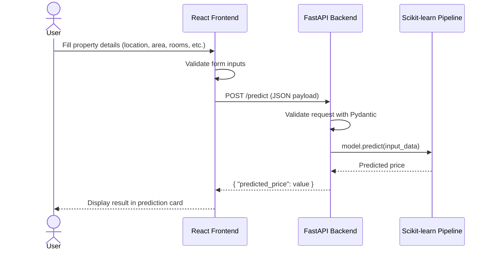
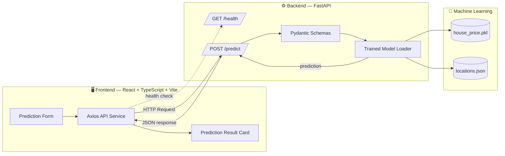
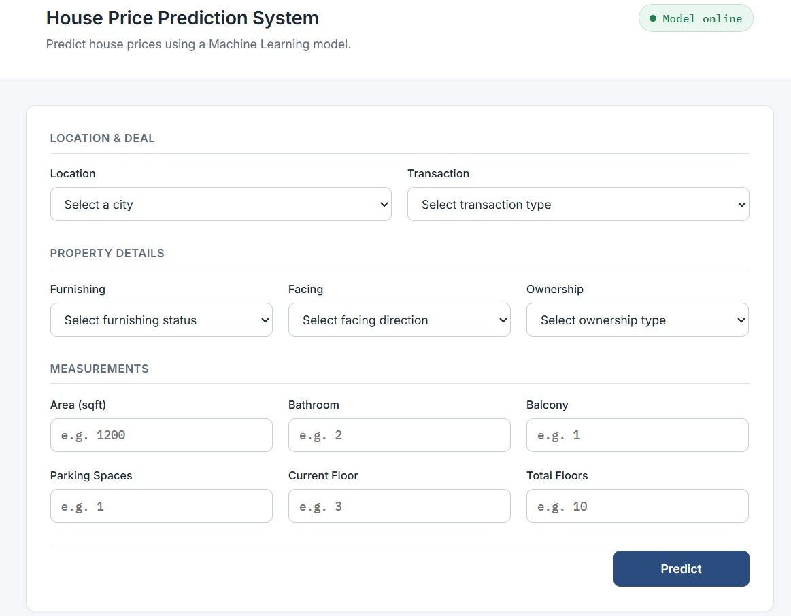
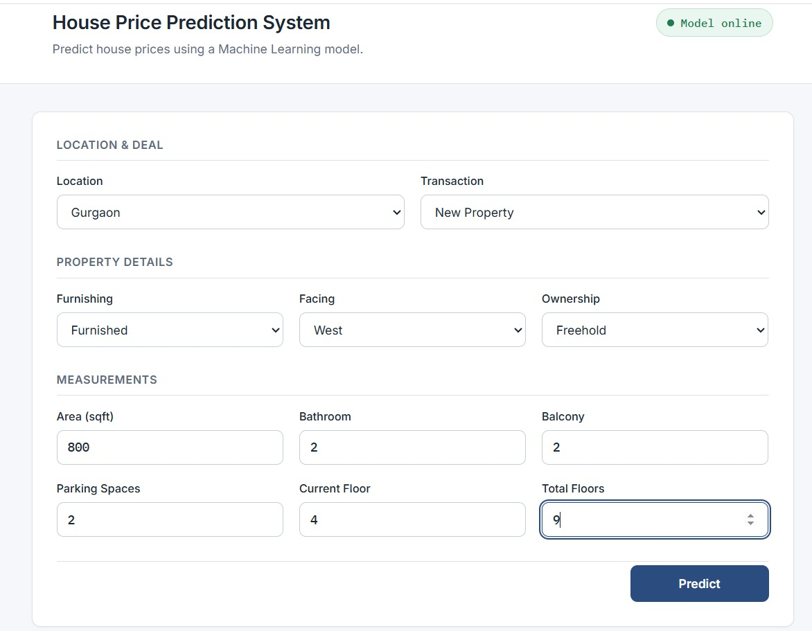
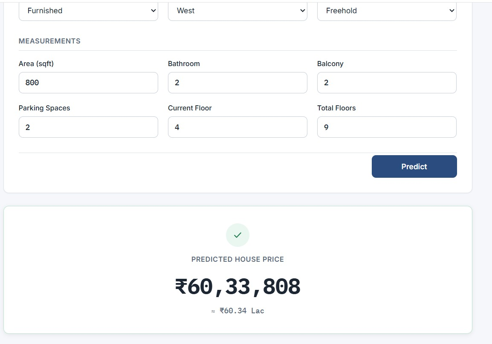
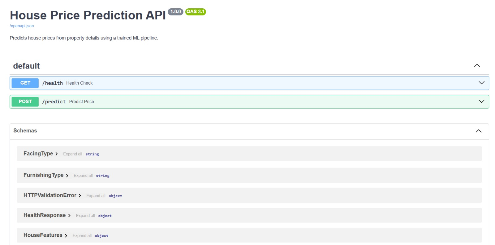

<div align="center">

# 🏡 House Price Prediction System

### End-to-End Machine Learning Web Application

A full-stack ML system that predicts house prices using a trained **Scikit-learn** model, served through a **FastAPI** backend, and consumed by a **React + TypeScript** frontend.

[](https://www.python.org/)
[](https://fastapi.tiangolo.com/)
[](https://react.dev/)
[](https://www.typescriptlang.org/)
[](https://vitejs.dev/)
[](https://scikit-learn.org/)
[](https://docs.pytest.org/)

[Features](#-features) •
[Architecture](#-architecture) •
[Installation](#-installation) •
[API Reference](#-api-endpoints) •
[Tech Stack](#-tech-stack)

</div>

---

## 📖 About The Project

**House Price Prediction System** is an end-to-end Machine Learning application that takes real property attributes — location, area, furnishing status, ownership type, and more — and returns a predicted market price in real time.

The project covers the **entire ML lifecycle**:

- 📊 Data cleaning, feature engineering, and exploratory analysis in a Jupyter notebook
- 🧠 Model training and comparison using Scikit-learn pipelines
- ⚙️ A production-style **FastAPI** backend that serves the trained model
- 💻 A clean, responsive **React + TypeScript** frontend for interacting with the model

The dataset used is [**House Price**](https://www.kaggle.com/datasets/juhibhojani/house-price) by **Juhi Bhojani**, sourced from Kaggle.

This project was built as a graduation project for the **ITI Machine Learning Track**, and doubles as a portfolio piece demonstrating the ability to take a model from raw data all the way to a deployed, user-facing application.

---

## ⭐ Highlights

- 🔄 End-to-end Machine Learning project — from raw data to a live prediction interface
- ⚙️ Production-ready **FastAPI** backend with request validation and structured error handling
- 💻 **React + TypeScript** frontend with strong typing across the entire request/response flow
- 🧪 Model training and preprocessing encapsulated inside a single **Scikit-learn Pipeline**
- 📐 **Cross-validation** used to assess model generalization
- 📘 Interactive, auto-generated **Swagger** API documentation
- ✅ Automated backend tests with `pytest`

---

## 📑 Table of Contents

- 🚀 [About The Project](#-about-the-project)
- ✨ [Highlights](#-highlights)
- 🌟 [Features](#-features)
- 🔄 [Demo Workflow](#-demo-workflow)
- 🏗️ [Architecture](#-architecture)
- 📁 [Project Structure](#-project-structure)
- 🗂️ [Dataset](#-dataset)
- 📓 [Notebook](#-notebook)
- 🤖 [Machine Learning Pipeline](#-machine-learning-pipeline)
- 📊 [Exploratory Data Analysis](#-exploratory-data-analysis)
- 🧠 [Model Training](#-model-training)
- 📈 [Model Evaluation](#-model-evaluation)
- ⚙️ [Backend Overview](#-backend-overview)
- 🎨 [Frontend Overview](#-frontend-overview)
- 🛠️ [Tech Stack](#-tech-stack)
- 🚦 [Project Status](#-project-status)
- 💻 [Installation](#-installation)
- ▶️ [Running the Backend](#️-running-the-backend)
- 🖥️ [Running the Frontend](#️-running-the-frontend)
- 🔌 [API Endpoints](#-api-endpoints)
- 📤 [Example Request](#-example-request)
- 📥 [Example Response](#-example-response)
- 🖼️ [Screenshots](#-screenshots)
- 🚀 [Future Improvements](#-future-improvements)
- 👨‍💻 [Author](#-author)

---

## ✨ Features

<table>
<tr>
<td width="50%" valign="top">

### 🧠 Machine Learning
- Full data cleaning & preprocessing pipeline
- Missing value handling
- Feature engineering & outlier removal
- Exploratory Data Analysis (EDA)
- Feature encoding via `ColumnTransformer`
- Model comparison (Linear Regression vs Random Forest)
- Cross-validation
- Exported, production-ready model (`.pkl`)

</td>
<td width="50%" valign="top">

### ⚙️ Backend (FastAPI)
- Model loaded once at startup
- Request validation with Pydantic
- Interactive Swagger documentation
- CORS enabled for frontend access
- Meaningful HTTP status codes
- Automated tests with `pytest`

</td>
</tr>
<tr>
<td width="50%" valign="top">

### 💻 Frontend (React + TypeScript)
- Clean, responsive prediction form
- Dropdown menus for categorical fields
- Numeric inputs for measurements
- Client-side validation with helpful errors
- Loading spinner during requests
- Friendly error handling (network/validation/server)
- Success notification on prediction
- Live backend health indicator

</td>
<td width="50%" valign="top">

### 🔗 Integration
- Dedicated Axios API service layer
- Configurable backend URL via environment variables
- Request payload matches backend schema exactly
- Strong TypeScript typing end-to-end

</td>
</tr>
</table>

---

## 🎬 Demo Workflow



---

## 🏗 Architecture



---

## 📁 Project Structure

```text
house-price-prediction/
│
├── backend/                          # FastAPI backend service
│   ├── app.py                        # Application entry point & routes
│   ├── model_loader.py               # Loads model + locations once at startup
│   ├── schemas.py                    # Pydantic request/response models
│   ├── house_price.pkl               # Trained Scikit-learn pipeline
│   ├── locations.json                # Valid location values
│   ├── requirements.txt              # Backend dependencies
│   ├── tests/
│   │   ├── test_health.py            # Tests for GET /health
│   │   └── test_predict.py           # Tests for POST /predict
│   └── README.md
│
├── frontend/                         # React + TypeScript client
│   ├── src/
│   │   ├── components/               # Form, Result, Layout, etc.
│   │   ├── services/                 # Axios API service
│   │   ├── hooks/                    # usePrediction, useBackendHealth
│   │   ├── types/                    # Shared TypeScript types
│   │   ├── constants/                # Dropdown option definitions
│   │   └── utils/                    # Validation & formatting helpers
│   ├── package.json
│   └── README.md
│
├── screenshots/                      # README screenshots
├── house_price_prediction_done.ipynb # Full ML notebook (EDA → model export)
├── house_price.pkl                   # Trained model (root copy)
├── locations.json                    # Location reference data
└── README.md                         # You are here
```

---

## 📂 Dataset

| | |
|---|---|
| **Name** | House Price |
| **Author** | Juhi Bhojani |
| **Source** | [Kaggle](https://www.kaggle.com/datasets/juhibhojani/house-price) |
| **Link** | [https://www.kaggle.com/datasets/juhibhojani/house-price](https://www.kaggle.com/datasets/juhibhojani/house-price) |

The dataset contains real-world residential property listings, including attributes such as location, area, furnishing status, ownership type, and facing direction — the same set of features used throughout the notebook and exposed by the prediction API. Full dataset details, column definitions, and licensing terms are available on the Kaggle dataset page linked above.

---

## 📓 Notebook

The full modeling workflow lives in [`house_price_prediction_done.ipynb`](house_price_prediction_done.ipynb). It walks through every stage of the project, in order:

- **Data Loading** — importing the raw dataset
- **Inspection** — reviewing structure, types, and initial data quality
- **Cleaning** — correcting inconsistent or malformed values
- **Missing Values** — identifying and handling incomplete records
- **Feature Engineering** — deriving and refining predictive features
- **Outlier Removal** — filtering out extreme, unrealistic data points
- **Exploratory Data Analysis (EDA)** — visualizing distributions and relationships
- **Pipeline** — assembling preprocessing and the estimator into one reproducible object
- **ColumnTransformer** — applying column-specific transformations to numeric and categorical features
- **Model Training** — fitting candidate regression models
- **Model Comparison** — evaluating models against one another
- **Cross Validation** — validating generalization across multiple folds
- **Evaluation** — scoring the final model with standard regression metrics
- **Model Export** — persisting the trained pipeline to `house_price.pkl`

---

## 🔬 Machine Learning Pipeline

The notebook (`house_price_prediction_done.ipynb`) documents the complete workflow from raw data to a deployable model:

| Stage | Description |
|---|---|
| **1. Data Loading** | Import the raw House Price dataset (Kaggle, by Juhi Bhojani) |
| **2. Data Inspection** | Explore structure, data types, and overall quality of the raw data |
| **3. Data Cleaning** | Standardize inconsistent values and correct malformed entries |
| **4. Missing Value Handling** | Impute or remove missing entries |
| **5. Feature Engineering** | Derive and refine predictive features from raw attributes |
| **6. Outlier Removal** | Remove extreme, unrealistic data points that distort model training |
| **7. Exploratory Data Analysis** | Visualize distributions and relationships to guide preprocessing decisions |
| **8. ColumnTransformer** | Apply distinct, column-specific transformations to numeric and categorical features |
| **9. Pipeline Construction** | Combine preprocessing and the estimator into a single, reproducible `Pipeline` |
| **10. Model Training** | Fit candidate regression models on the processed training data |
| **11. Model Comparison** | Compare candidate models against one another on held-out data |
| **12. Cross Validation** | Validate generalization performance across multiple folds |
| **13. Model Evaluation** | Score the final model using standard regression metrics |
| **14. Model Export** | Persist the trained pipeline to `house_price.pkl` for serving |

Preprocessing and the estimator are encapsulated inside a single Scikit-learn `Pipeline`, rather than being applied as separate, manual steps. This guarantees that the **exact same transformations** — encoding, column selection, and scaling — are applied consistently during both training and inference. When the FastAPI backend loads `house_price.pkl` and calls `.predict()`, the incoming request is passed through that same pipeline, eliminating train/serve skew by design.

---

## 📈 Exploratory Data Analysis

The notebook includes a dedicated EDA stage used to understand the dataset before any modeling decisions were made. Key visualizations include:

| Visualization | Purpose |
|---|---|
| **Distribution of Price** | Understand the overall spread and skew of house prices |
| **Price vs Area** | Examine the relationship between property size and price |
| **Average Price by Location** | Compare pricing trends across different cities |
| **Furnishing Analysis** | Assess how furnishing status relates to price |

These visualizations directly informed downstream decisions in the pipeline — including outlier removal thresholds, feature engineering choices, and which categorical features carried meaningful predictive signal.

---

## 🧠 Model Training

Two regression models were trained and evaluated using a shared preprocessing pipeline (`ColumnTransformer` + `OneHotEncoder`), ensuring both models were trained and compared under identical preprocessing conditions:

| Model | Type |
|---|---|
| **Linear Regression** | Baseline linear model |
| **Random Forest Regressor** | Ensemble tree-based model |

Both models were assessed through cross-validation before a final pipeline was selected. The best-performing pipeline was serialized to `house_price.pkl` and is loaded directly by the FastAPI backend — **no retraining occurs in production.**

---

## 📊 Model Evaluation

Models were evaluated using standard regression metrics:

| Metric | Description |
|---|---|
| **MAE** | Mean Absolute Error — average magnitude of prediction errors |
| **RMSE** | Root Mean Squared Error — penalizes larger errors more heavily |
| **R²** | Coefficient of Determination — proportion of variance explained by the model |

| Model | MAE | RMSE | R² |
|---|---|---|---|
| Linear Regression | ₹4,469,653 | ₹6,862,553 | 0.615 |
| Random Forest | ₹1,457,309 | ₹3,571,682 | 0.896 |
| Gradient Boosting | ₹2,732,632 | ₹4,575,338 | 0.829 |

> **Best model:** Random Forest — lowest error and highest R² (0.896), so it was selected and exported as `house_price.pkl`.

> 📓 Full metric values and model comparison results are available in `house_price_prediction_done.ipynb`.

---

## ⚙️ Backend Overview

Built with **FastAPI**, the backend is a thin, well-tested wrapper around the trained model.

- Loads the trained pipeline (`house_price.pkl`) and `locations.json` **once** at startup
- Validates every request with **Pydantic** models
- Returns clear, meaningful HTTP status codes (`200`, `400`, `422`, `500`)
- **CORS** enabled for cross-origin requests from the frontend
- Interactive **Swagger UI** available at `/docs`
- Covered by `pytest` tests for both endpoints

<details>
<summary><strong>📂 Backend structure</strong></summary>

```text
backend/
├── app.py             # FastAPI app, routes, exception handling
├── model_loader.py     # Loads model & locations once
├── schemas.py           # Pydantic request/response schemas
├── requirements.txt     # Backend dependencies
└── tests/
    ├── test_health.py
    └── test_predict.py
```

</details>

---

## 💻 Frontend Overview

Built with **React + TypeScript + Vite**, the frontend provides a clean, form-driven interface for generating predictions.

- Dropdown menus for categorical fields (location, transaction, furnishing, facing, ownership)
- Numeric inputs for measurements (area, bathrooms, balconies, parking, floors)
- Client-side validation with helpful, field-level error messages
- Loading spinner while a prediction is in progress
- Distinct error handling for network issues, validation errors, and server errors
- Success notification once a prediction completes
- Live backend health indicator in the header

<details>
<summary><strong>📂 Frontend structure</strong></summary>

```text
frontend/
├── src/
│   ├── components/
│   │   ├── Layout/            # Header (with health indicator) & Footer
│   │   ├── PredictionForm/    # Form + reusable Select/Number fields
│   │   ├── PredictionResult/  # Result card
│   │   ├── ErrorBanner/       # Error messaging
│   │   ├── Toast/             # Success notification
│   │   └── LoadingSpinner/    # Loading state indicator
│   ├── services/api.ts        # Axios instance & backend calls
│   ├── hooks/                 # usePrediction, useBackendHealth
│   ├── types/                 # Types mirroring the backend schema
│   ├── constants/              # Dropdown option definitions
│   └── utils/                  # Validation & currency formatting
└── package.json
```

</details>

---

## 🛠 Tech Stack

<table>
<tr>
<th>Layer</th>
<th>Technology</th>
</tr>
<tr>
<td><strong>Machine Learning</strong></td>
<td>Python, Pandas, Scikit-learn, Jupyter Notebook</td>
</tr>
<tr>
<td><strong>Backend</strong></td>
<td>FastAPI, Pydantic, Uvicorn, pytest</td>
</tr>
<tr>
<td><strong>Frontend</strong></td>
<td>React, TypeScript, Vite, Axios</td>
</tr>
<tr>
<td><strong>Model Artifact</strong></td>
<td>Pickle (<code>.pkl</code>)</td>
</tr>
</table>

---

## 🚀 Project Status

| Component | Status |
|---|---|
| Machine Learning Notebook | ✅ Completed |
| FastAPI Backend | ✅ Completed |
| React Frontend | ✅ Completed |
| End-to-End Prediction Pipeline | ✅ Completed |

---

## 🚀 Installation

### Prerequisites

| Requirement | Version |
|---|---|
| Python | 3.10+ |
| Node.js | 18+ |
| npm | 9+ |

### Clone the repository

```bash
git clone https://github.com/ibrahimsherif-eng/house-price-prediction.git
cd house-price-prediction
```

---

## ▶️ Running the Backend

```bash
cd backend

# Create and activate a virtual environment
python3 -m venv venv
source venv/bin/activate      # Windows: venv\Scripts\activate

# Install dependencies
pip install -r requirements.txt

# Run the API
uvicorn app:app --reload
```

The backend will be available at:

| Resource | URL |
|---|---|
| API Base | `http://127.0.0.1:8000` |
| Swagger Docs | `http://127.0.0.1:8000/docs` |
| ReDoc | `http://127.0.0.1:8000/redoc` |

---

## ▶️ Running the Frontend

```bash
cd frontend

# Install dependencies
npm install

# Configure the backend URL
cp .env.example .env
# VITE_API_BASE_URL=http://127.0.0.1:8000

# Run the development server
npm run dev
```

The frontend will be available at `http://localhost:5173`.

---

## 📡 API Endpoints

| Method | Endpoint | Description |
|---|---|---|
| `GET` | `/health` | Returns API health status |
| `POST` | `/predict` | Returns a predicted house price for given property details |

---

## 📤 Example Request

**`POST /predict`**

```json
{
  "location": "pune",
  "area_sqft": 1200,
  "Transaction": "New Property",
  "Furnishing": "Semi-Furnished",
  "facing": "East",
  "Ownership": "Freehold",
  "Bathroom": 2,
  "Balcony": 2,
  "car_parking_count": 1,
  "current_floor": 3,
  "total_floors": 10
}
```

## 📥 Example Response

```json
{
  "predicted_price": 6237616.84
}
```

**Health check**

```bash
curl http://127.0.0.1:8000/health
```

```json
{
  "status": "ok"
}
```

---

## 🖼 Screenshots

<div align="center">

| Home Page | Filled Prediction Form |
|---|---|
|  |  |

| Prediction Result | Swagger Documentation |
|---|---|
|  |  |

</div>

---

## 🔮 Future Improvements

- [ ] Add a `/locations` endpoint so the frontend fetches valid values dynamically
- [ ] Containerize backend and frontend with Docker
- [ ] Add CI/CD pipeline for automated testing and deployment
- [ ] Expand model comparison with additional algorithms
- [ ] Add authentication for API usage tracking
- [ ] Deploy backend and frontend to a public hosting platform

---

## 👤 Author

**Ibrahim Sherif**
*Machine Learning Engineer*

- GitHub: [@ibrahimsherif-eng](https://github.com/ibrahimsherif-eng)

Built as a graduation project for the **ITI Machine Learning Track**.

<div align="center">

⭐ If you found this project useful, consider giving it a star!

</div>
